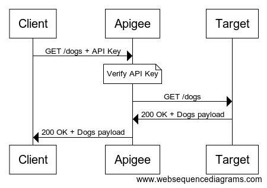
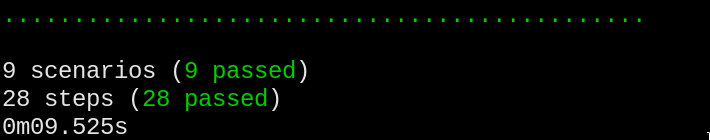
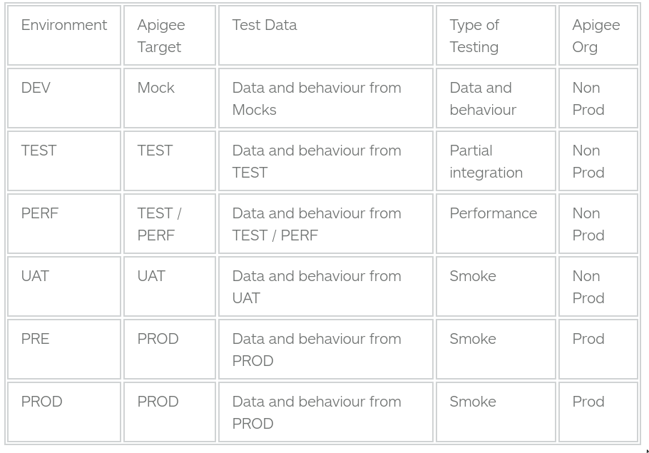
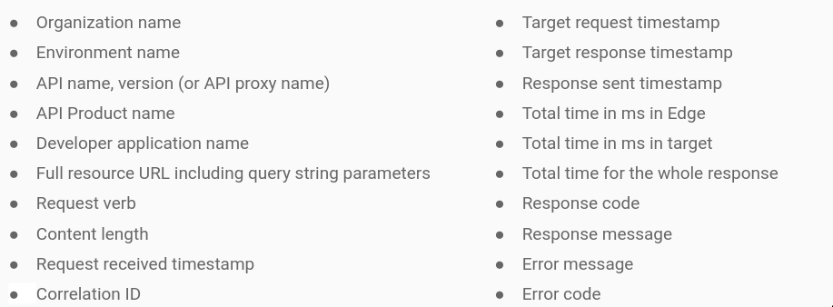

id: apigee-hackathon

# Apigee Hackathon

## Introduction

Welcome to the __Apigee Hackathon__!


This lab was written to help understand the typical tasks of an API developer so that we can advise them on development best practices. It is hands on and assumes some knowledge of the Apigee platform.

Ideally you will have completed the Apigee Coursera [Design](https://www.coursera.org/learn/api-design-apigee-gcp), [Development](https://www.coursera.org/learn/api-development-apigee-gcp) and [Security](https://www.coursera.org/learn/api-security-apigee-gcp) Courses. Alternatively, completing the Apigee [API Jam](https://github.com/apigee/apijam) will cover the same topics in less depth.

Please complete this API Jam if you have not already.

### Badges

On completion, please send the following to apigee-cs-emea-tsc@ with the Subject: `I Love API Hackathons!` and you will receive a badge!

- Architecture Diagram
- Flow Diagram
- Screenshot of Test Results
- Screenshot of any bonus material completed

## Prerequisites

Apigee has an online Development Environment (below), but customers typically use local development tools. This way they can use the editor, source control and continuous integration tools of their choice.


Please ensure that you have the following:

- Web Browser (recent version of [Chrome](https://www.google.com/chrome/) or [Firefox](https://www.mozilla.org/en-GB/firefox/new/))
- Evaluation Apigee [Account](https://login.apigee.com/sign__up)
- [Maven](https://maven.apache.org/) (3.0.2+), [Java JDK](https://java.com/en/download/manual.jsp) (8+) and [NodeJS](https://nodejs.org/) (10+)
- A REST Client - [Postman](https://www.postman.com/) or [Curl](https://curl.haxx.se/)
- Favourite text editor like Visual Studio [Code](https://code.visualstudio.com/) or `vim`

BONUS
- For the bonus activities, you will need Docker or a GCP Account


## Scenario

__Mayfair Motors__ are adding __Connected Car__ functionality to their cars. They will add sensors to provide telemetry to users via API. For their first use case, they would like to allow companies to view information for their fleet of companies cars. This data will be collected by a server every night at midnight.

They have a number of concerns:

- How will they secure the APIs?
- How will they measure the usage?
- How will they onboard consumers?

In addition, they want to know:

- How can they automate their deployments?
- How can they govern their APIs as the Program grows?
- What is the correct architecture?


## Architecture

```
  +---------------+     +-------------------+
  | Web Clients   |     | Developer Portal  |
  +---------------+     +-------------------+

  +-----------------------------------------+
  |                 Apigee                  |
  +-----------------------------------------+

  +-----------------------------------------+
  |               App Engine                |
  +-----------------------------------------+

  +-----------------------------------------+
  |             Metrics Database            |
  +-----------------------------------------+

```

Apigee SaaS has the following constraints:
- Apigee is hosted on the Public Internet. All clients and targets must also be on the public internet
- VPNs and network peering are not supported
- At the transport layer, Mutual TLS is recommend to secure target communication
- At the application layer, OAuth 2, JWTs or Basic Authentication can also be used

In contrast, Apigee Hybrid allows customers to host their own runtime components and as such they have control over network topology.

#### Task

Draw your own Architecture diagram indicating each connection, whether it is on the public or private internet and how it is secured.

## Flows

### OAuth Grant Type

Below is a summary of the OAuth 2 grant types:

| | | |
|---|---|---|
| *Grant Type* | *Entities Authenticated* | *Client Type* |
| Client Credentials | Client | Private Server |
| Password | Client, User | Trusted Private Server |
| Auth Code | Client, User | Untrusted Private Server |
| Implicit | Client, User | Untrusted Public Client |

You can find a full description of the OAuth grant types [here](https://tools.ietf.org/html/rfc6749)

#### Question 

Which OAuth 2 Grant Type should be implemented for this use case? Review the scenario in chapter 3 to help to decide.

### Flow

Lets draw a flow diagram illustrating the flow you have chosen. 

We can use a tool like [Web Sequence Diagrams](https://websequencediagrams.com) or PlantUML

Here is an example of a high level API flow diagram.

```
participant Client as c
participant Apigee as a
participant Target as t

c->a: GET /dogs + API Key
note over a: Verify API Key
a->t: GET /dogs
t->a: 200 OK + Dogs payload
a->c: 200 OK + Dogs payload
```
...will produce...



#### Task

Please draw a flow diagram for the APIs we will build given the following example request and responses.

```
POST /identity/v1/token
Authorization: Basic (user):(pass)
```

```
200 OK
{
  "access_token": "(token)",
  ...
}
```

```
GET /vehicles/123
Authorization: Bearer (token)
grant_type=client_credentials
```

```
200 OK
{
  "id":"123",
  "licenseplate":"ZH-ABCD",
  ...
}
```

## Parallel Development

### Customer Problem 

The API developers want to create their APIs before the backend systems are ready. They also want to release the API sandbox as soon as possible for their partners to consume.

### Mocking

There are a some common ways to achieve mocking. 
- Javascript [Callout](https://community.apigee.com/articles/80296/simple-mocking-with-javascript-callout.html)
- [API Mocker](https://www.npmjs.com/package/apimocker) NodeJS Library - [sample](https://github.com/laughingbiscuit/lbdk/tree/master/projects/apimocker-hostedtargets)
- Mocks derived from Open API [Specs](https://github.com/apigee-127/swagger-tools)

Using either Assign Message policies or the API Mocker library, deploy mocks for the following:

#### Status Mock

```
GET /mock/v1/status
```
```
200 OK 
{
  "success": true
}
```

#### Vehicles Mock

```
GET /mock/v1/vehicles
```
```
200 OK 
{
    "vehicles": [
      "123"
    ]
}
```

#### Single Vehicle Mock

```
GET /mock/v1/vehicles/123
```

```
{
    "id": "123",
    "licenseplate": "ZH-ABCD",
    "finorvin": "WDD***********123",
    "nickname": "Hans Muster",
    "modelyear": "2018",
    "colorname": "polarweiss",
    "fueltype": "Benzin",
    "powerhp": "612",
    "powerkw": "450",
    "numberofdoors": "5",
    "numberofseats": "5",
    "fuellevelpercent": {
        "value": 40
    }
}
```

#### Vehicle Not Found Mock

```
GET /mock/v1/vehicles/*
```

```
404 Resource Not Found
{
    "error": "Vehicle not found"
}
```

## API Management

### Customer Problem

We have a mock of our backend service, so now we need to build a API Proxy in front of the mock. We can configure policies in the proxy for Traffic Management, Security, Mediation, Analytics and Orchestration.

### Task

Build and deploy a `fleet-v1` API Proxy that is a passthrough to your mocks.

If you do this correctly, the following url should return a successful response.

```
https://(your org name)-test.apigee.net/fleet/v1/vehicles
```

## Improving Performance

### Customer Problem

The customer notices that often the backend systems are slow as a result of high traffic loads. Most of the requests are GETs, and the data doesn't change very often. The customer has indicated that they don't mind if the data is up to an hour old.

### Task

Implement caching using the [Response Cache](https://docs.apigee.com/api-platform/reference/policies/response-cache-policy) policy to improve performance times. 

Please note the following:

- We should create our own `CacheResource` rather than using the default. This will allow us to clear the cache from the UI
- We should be able to set a different cache TTL for each environment

## Delegating Access to Third Parties

### Customer Problem

Currently, anybody can access these APIs without credentials. 

As discussed in chapter 5, the customer would like to use OAuth 2 to delegate access to selected third parties for a limited time and scope.

### Task

- Create an API proxy without a target called `identity-v1`
- Configure the policy to generate tokens for the client_credential grant type
- Create an API Product, Developer and Developer App
- Generate a token

__hint: you should be able to implement this using a single policy__

#### Example

```
POST /identity/v1/token
Authorization: Basic (user):(pass)
grant_type=client_credentials
```

```
200 OK
{
  "access_token": "(token)",
  ...
}
```

## Protecting API Resources

### Customer Problem

Now that tokens can be generated, we need to actually validate them in order to protect our APIs. This will allow us to reject unauthorized consumers.

### Task

- Validate Access Tokens on your Fleet API

#### Invalid Token Example

```
GET /fleet/v1/vehicles
```

```
401 Unauthorized
```

#### Valid Token Example

```
GET /fleet/v1/vehicles
Authorization: Bearer (valid token)
```

```
200 OK 
{
  (success payload)
}
```

#### Tips

- Make sure your API Product contains the correct proxies and is enabled for the correct environment

## Monitoring Uptime

### Customer Problem

The customer would like to poll some endpoints to ensure that the API is up and running.

According to the best practices described [here](https://community.apigee.com/articles/17862/forming-an-api-monitoring-strategy-where-to-start.html), we will create the following endpoints on the `fleet-v1` proxy.

#### Ping

Checks if the proxy is deployed, but doesn't hit the target.

```
GET /fleet/v1/ping
```

```
200 OK
{
  "success": true
}
```

#### Status

Checks if the proxy is deployed, and *does* check the target connectivity.

```
GET /fleet/v1/status
```

```
200 OK
{
  "success": true
}
```

#### Tips

- `/ping` and `/status` shouldn't require an access token
- Check your `<RouteRule>`s to ensure you aren't hitting the backend when you call `/ping`

## Lets Test!

If you are in an Apigee Hackathon session, ask the teacher to run the tests. You will need to provide:

- API Hostname e.g. `sean-eval-test.apigee.net`
- A Valid Client ID
- A Valid Client Secret

If you want to run the tests yourself, do the following:

```
cd testrunner
docker build -t testrunner .
docker run -it testrunner
```
.. and you will be prompted for the required information.



### Testing Tools

These tests are written using [Apickli](https://github.com/apickli/apickli).


## BONUS Analytics Custom Reporting

### Customer Problem

Whilst it is simple for the technical teams to look at the analytics data, a Product Owner would like to see a simple dashboard that shows who is using the `fleet-v1` APIs.


### Task

Create a custom report that shows the Traffic for each Developer App. This must be filtered to only show `fleet-v1`

_hint: make your you have selected the correct environment!_

## BONUS Continuous Integration

### Customer Problem

Now that the development against mocks is completed, the team would like to automate the promotion of code through the environments.

#### Organizations and Environments

After reading [this](https://community.apigee.com/questions/22800/how-have-you-setup-your-orgenv-combos.html) article, they have decided on the following:



#### Pipeline Steps

After looking at a Jenkins [example](https://github.com/apigee/maven-jenkins-ci-demo) and reading some [articles](https://community.apigee.com/articles/35173/continuous-integration-for-api-proxies.html), they decide their pipeline will have the following steps:

- Clone repo and checkout branch
- Static code analysis/linting
- Unit testing
- Proxy deployment
- Integration testing
- Promotion to next environment

#### Role Based Access Control

They also consider that the credentials used to deploy to production are sensitive and should have limited scope.

They use the [Management API](https://docs.apigee.com/api-platform/system-administration/managing-roles-api) to create a custom role that can only deploy, and has no other read access.

#### Task

Create a build pipeline in Cloud Build that completes these steps. You can refer to this [article](https://community.apigee.com/articles/67363/apigee-cicd-with-gcp-cloud-source-repositories-gcp.html) for help.

## BONUS Publishing in a Developer Portal

### Customer Problem

There is a debate between two groups of stakeholders on the customer site. 

The technical team would like to quickly spin up a portal so that Client IDs and Secrets can be managed in a self-service way. This will reduce the burden on them.

The marketing and business teams would like to invest time in creating a world class Developer Portal that matches their existing site. They would like to add blogs and forums as well as custom interactive content to demonstrate how their connected cars work. Before investing too much time, they want to quickly evaluate their options.

#### Tasks

- Create an [Integrated Developer Portal](https://docs.apigee.com/api-platform/publish/portal/build-integrated-portal) that allows Developers to quickly view documentation and manage their credentials.

- Create an [Apigee Drupal Kickstarter](https://github.com/apigee/docker-apigee-drupal-kickstart) instance to demonstrate the extensibility of the portal to the marketing teams.

## BONUS Logging

### Customer Problem

When debugging issues, the Infrastructure and Operations team would like all logs to be centralised in a single place.

In order to effectively investigate issues, they would like the following information for each API request.



### Task

- Using the Google Stackdriver Logging [Extension](https://docs.apigee.com/api-platform/reference/extensions/google-stackdriver-logging/google-stackdriver-logging-extension-121) ensure that one log is written per request with this information
- Ensure that logs are written for *both* success and error cases
- If you get stuck, see an example [here](https://github.com/DinoChiesa/Edge-Stackdriver-Example)

## BONUS Error Handling

### Customer Problem

After developing many more proxies, the team have noticed that API consumers are struggling to work with the error messages provided. Each backend returns a different error format.

The team read this [article](https://community.apigee.com/articles/23724/an-error-handling-pattern-for-apigee-proxies.html) and decide on the following standardised error format.

```
400 Bad Request

{
  "error":"Invalid Vehicle Identifier",
  "code": "400.01.001",
  "url": "https://developer.example.com"
}
```

This contains a human readable error, a code that can be used by the client application's error handling and a link to relevant documentation.

### Task

- By following the article, implement `<RaiseFault>`s, `<FaultRule>`s and `<DefaultFaultRule>`s to provide consistent error handling.


